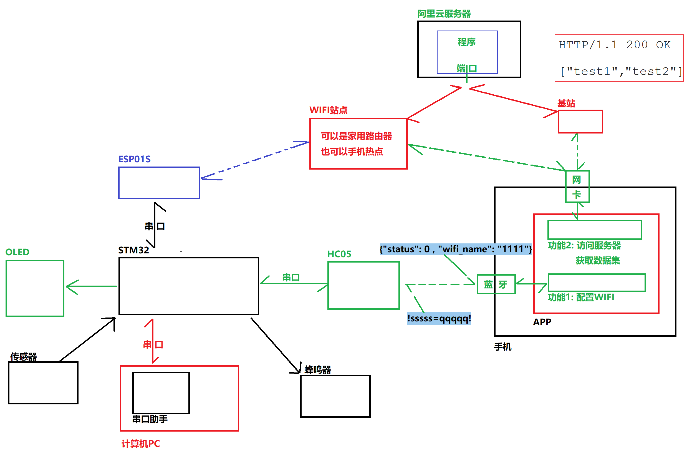
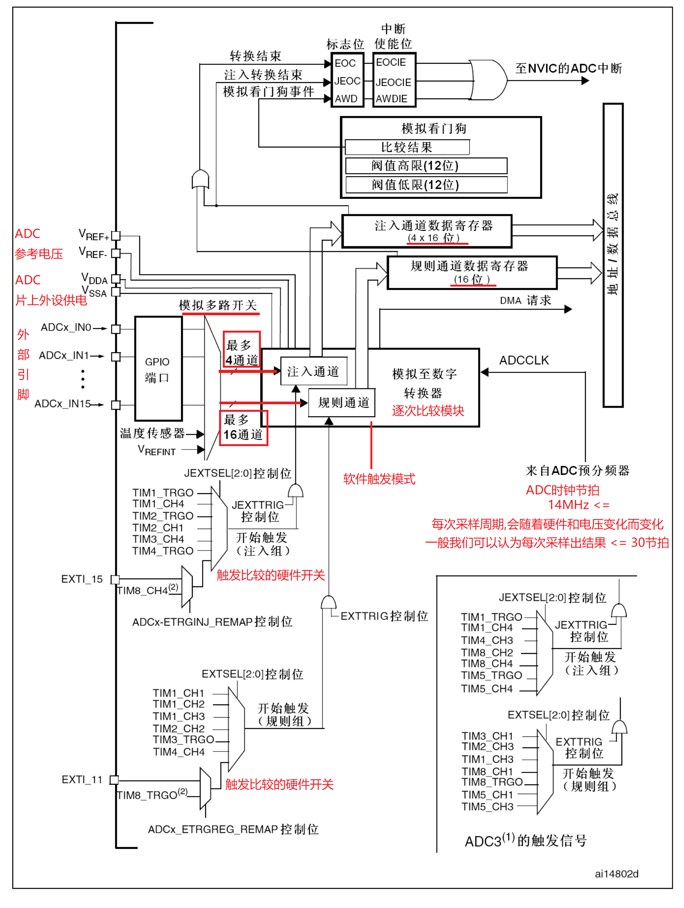
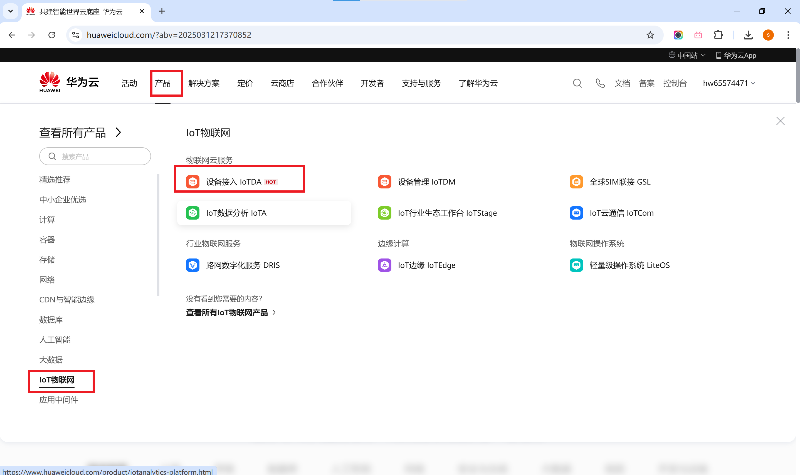
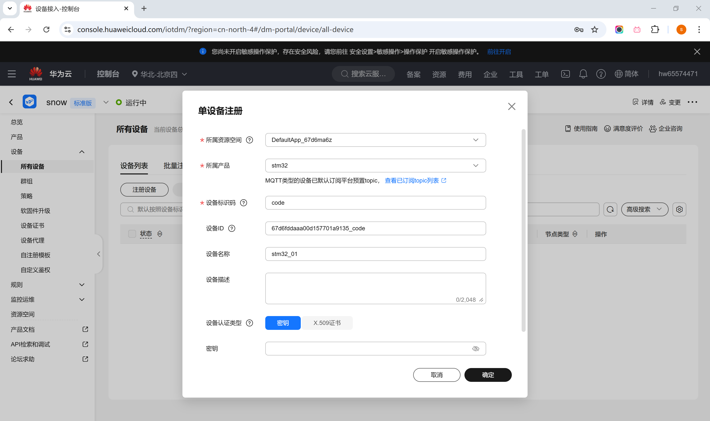

# 1, 第一期

## 1.1 项目架构

>

## 1.2 HC05

>
>
>HC-05是一款比较经典的蓝牙(Bluetooth 2.0+EDR)的串行通信模块, 广泛用于无线串口通信, 支持主从模式切换, 可用于MCU、电脑、手机等设备之间的无线数据传输.
>
>```C
>// 模块: 所谓模块, 就是把芯片和外围电路、电源管理模块、外部晶振、电压保护电路(稳压电路)、复位按键、外接接口等等各种硬件, 和设计好的电路板集成到一起, 以供用户使用.
>// 比如一般HC_05使用的芯片都是CSR BC417芯片, 他不能被单独使用, 因为这个芯片甚至本身连天线都不带. 更不用说电源稳压,电路保护等硬件功能电路.
>
>// CSR BC417芯片:
>// 改芯片是英国Cambridge Silicon Radio(CSR)公司推出的一款经典蓝牙(Bluetooth 2.0+EDR)芯片, 广泛用于无线串口通信、蓝牙音频设备和嵌入式蓝牙模块.
>```
>
>Bluetooth 2.0+EDR
>
>```C
>// Bluetooth2.0+EDR(Enhanced Data Rate)是一种蓝牙协议标准(蓝牙技术联盟Bluetooth SIG在2004年发布的第二代蓝牙标准), 属于经典蓝牙(BR/EDR，Basic Rate/Enhanced Data Rate)技术, 用于无线短距离数据通信.
>// 该技术标准所支持的通信速率最高为3Mbps, 但在实际使用中通常为2.1Mbps
>
>// 注意现在的智能手机普遍采用蓝牙5.0及以上版本的标准(蓝牙5.0于2016年发布, 最高支持2Mbps, 但是功耗超低, 抗干扰能力一般, 但是比较适合Wi-Fi共存环境, 因为做了共存优化), 甚至在蓝牙技术联盟在2024年9月发布了蓝牙6.0标准(现在处于推广阶段)
>```
>
>HC05的一些参数:
>
>```C
>// 蓝牙协议: Bluetooth 2.0+EDR(Enhanced Data Rate)
>// 工作频率: 2.4GHz频段
>// 通讯方式: 串口(UART)
>// 波特率: 默认9600
>// 引脚电压: 3.3V
>// 模块供电: 3.6~6V
>// 支持主从模式: 支持主机(Master)和从机(Slave)模式
>// 支持AT指令: 可用于配置设备名称、波特率、主从模式等
>```
>
>引脚定义
>
>```c
>// VCC: 模块供电, 建议5V
>// GND: 接地
>// TXD: 串口发送
>// RXD: 串口接收
>// EN: 使能(可悬空 OR 高电平)
>// STATE: 指示连接状态(可悬空 OR 高电平)
>```
>
>工作模式
>
>````C
>// 数据传输模式:  (有蓝牙连接自动进入数据传输模式)
>//		用于普通串口通信
>//		配对成功后, 可以直接像普通串口一样收发数据
>
>// AT指令模式:   (没有蓝牙连接自动进入AT指令模式)
>//		通过AT指令配置HC-05的参数(如主从模式、波特率、设备名称等)
>
>
>// 注意: 在蓝牙中
>// 主模式(Master)设备负责主动搜索和建立连接
>// 从模式(Slave)设备等待主机搜索、配对和连接, 它自身不能主动连接其他设备
>````
>
>常用AT指令: (HC05蓝牙模块AT指令集.pdf) 
>
>```c
>// 注意: 使用AT指令的时候, 记得断开主从两个蓝牙之间的连接
>//		AT指令一般需要换行标识
>
>// AT : 测试指令, 返回OK
>// AT+NAME? : 获取设备名称
>// AT+NAME=snow : 把蓝牙模块设备名改为snow
>// AT+ROLE? : 获取HC05的模式
>// AT+ROLE=0 : 把模式修改为主模式
>// AT+UART? : 查看串口"波特率,停止位,检验位"
>// AT+UART=115200,1,2 : 修改串口的"波特率,停止位,检验位"
>// ....
>```

## 1.3 ESP01S

>
>
>
>
>
>
>ESP01S是一款基于ESP8266芯片的Wi-Fi模块(属于ESP8266芯片家族), 是由乐鑫(Espressif)公司推出的一款小型、低功耗的无线网络连接模块(基于无线局域网技术), 比较广泛用于物联网(IoT)、智能家居、远程控制等应用.  其中该模块支持标准的IEEE802.11 b/g/n协议, 并且芯片内置完整的 TCP/IP协议栈.
>
>```C
>// IEEE802.11 b/g/n协议:
>//		IEEE802.11是无线局域网(Wi-Fi)的标准, 由IEEE(美国电气电子工程师学会)制定. 不同的Wi-Fi标准以IEEE802.11开头,后面带有不同的字母后缀(如:b/g/n/ac/ax), 表示不同的技术规格.
>    
>// ESP01S芯片核心: Tensilica L106超低功耗32位微型MCU
>//		Tensilica L106是一款低功耗、基于Xtensa处理器架构的32位RISC处理器, 由Cadence(腾思电子,Tensilica现为Cadence旗下品牌)设计.
>```
>
>| **标准**    | **发布年份** | **工作频段**        | **最大速率** | **带宽**  | **调制方式**       | **适用场景**        |
>| ----------- | ------------ | ------------------- | ------------ | --------- | ------------------ | ------------------- |
>| **802.11b** | 1999         | **2.4 GHz**         | **11 Mbps**  | 20 MHz    | DSSS(直接序列扩频) | 早期Wi-Fi设备       |
>| **802.11g** | 2003         | **2.4 GHz**         | **54 Mbps**  | 20 MHz    | OFDM(正交频分复用) | 早期无线路由/笔记本 |
>| **802.11n** | 2009         | **2.4 GHz / 5 GHz** | **600 Mbps** | 20/40 MHz | OFDM、MIMO         | 现代主流Wi-Fi设备   |
>
>ESP01S的一些参数:
>
>```C
>// Wi-Fi标准: 802.11 b/g/n (2.4GHz)
>// 工作电压: 3.3V (不可以接5V)
>// 工作电流: 80mA~300mA(峰值)
>// GPIO引脚: 2个
>// 波特率: 默认115200
>// 通信接口: UART通信
>// ...
>```
>
>引脚定义
>
>````C
>// VCC: 3.3V(不可以接5V, 可能会烧掉)
>// GND: 接地
>// TX: 串口发送
>// RX: 串口接收
>// GPIO0: 通用I/O, 如果要重新烧录固件需要接地  (可以悬空)
>// GPIO2: 通用I/O  (可以悬空)
>// RST: 复位(低电平复位, 尽量不要悬空, 接高电平3.3v)
>// EN:  使能(尽量不要悬空, 接高电平3.3v)
>````
>
>工作模式
>
>```C
>// STA模式(Station, 户端模式)
>// 		作为客户端连接路由器
>
>// AP模式(Access Point,热点模式)
>//		作为Wi-Fi端点(类似于路由器), 以供联网设备连接上网
>
>// AP+STA模式(混合模式)
>//		同时作为AP和STA, 常用于局域网通信
>```
>
>常用AT指令: (  esp8266_at_指令集.pdf) 
>
>```C
>// 注意: AT指令一般需要换行标识
>
>// AT : 测试指令, 返回OK
>// AT+CWMODE_DEF? : 查询模块模式(1=Station模式; 2=SoftAP模式; 3=Station模式+SoftAP模式)
>//					我们需要使用1=Station模式
>// AT+CWMODE_DEF=1 : 把模式设置为Station模式
>// AT+CWLAP : 查找可用的AP站点列表 (查找可以连接的网络)
>// AT+CWLAP="snow" : 查找站点名为snow的AP站点
>// AT+CWJAP_DEF? : 查看已经连接的AP信息
>// AT+CWJAP_DEF="snow","12345678" : 配置网络连接, 连接到snow网络, 密码是12345678
>
>// AT+CIPSTART="TCP","47.115.220.165",8000 : 建立TCP连接, 连接到47.115.220.165的8000端口
>//											需要服务器监听这个端口, 接收请求, 可回传信息
>// AT+CIPMODE=1 : 开启透传模式(准备收发TCP数据)
>// AT+CIPSEND : 开始准备发送数据
>
>// 发送数据
>// +++ : 退出透传模式(发送了不带换行的+++给ESP01S, 他可能需要略微反应一下)
>
>// AT+CIPMODE=0 : 关闭透传模式
>// AT+CIPCLOSE : 关闭TCP连接
>// ....
>```

## 1.4 服务器程序

>服务器应该具有接收STM32通过ESP01S发送给服务器数据的能力
>
>```C
>// 建议STM32发送数据的时候, 不要直接发送TCP数据, 而是构建一个HTTP报文发给服务器, 更符合大场景和服务器大框架设计
>```
>
>```C
>// 示例1
>#include <stdio.h>
>#include <stdlib.h>
>#include <string.h>
>#include <unistd.h>
>#include <arpa/inet.h>
>#include <sys/socket.h>
>#include <sys/select.h>
>#include <pthread.h>
>int main() {
>    int socket_fd = socket(AF_INET, SOCK_STREAM, 0);
>
>    char *port = "8000";
>    char *ip = "0.0.0.0";
>    struct sockaddr_in sockaddr;
>    sockaddr.sin_family = AF_INET;
>    sockaddr.sin_port = htons(atoi(port));
>    sockaddr.sin_addr.s_addr = inet_addr(ip);
>    int reuse = 1;
>    setsockopt(socket_fd, SOL_SOCKET, SO_REUSEADDR, &reuse, sizeof(reuse));
>    bind(socket_fd, (struct sockaddr *)&sockaddr, sizeof(sockaddr));
>    listen(socket_fd, 10);
>
>    int net_fd = accept(socket_fd, NULL, NULL);
>    while(1){
>        char buf[60] = {0};
>        recv(net_fd, buf, sizeof(buf), 0);
>        printf("buf: %s \n", buf);
>    }
>
>    send(net_fd, "hello_zs", 8, MSG_NOSIGNAL);
>
>    while(1);
>
>    close(socket_fd);
>    return 0;
>
>}
>
>```

>服务器应该具有转给手机数据的能力
>
>```C
>// 当手机APP通过HTTP请求, 请求服务器, 服务器应该能把自己从STM32发过来的数据, 先存储, 再转发给手机APP(实际就是回复HTTP请求的响应报文)
>
>// HTTP的请求具有固定格式:
>//		资源路径/1: 获取数据
>//		资源路径/2: 清空缓存
>
>// 要求返回的数据是一个具有固定格式的JSON数据
>```
>
>````c
>// 示例
>HTTP/1.1 200 OK
>
>["test1","test2","test3"]
>````
>
>```C
>#include <stdio.h>
>#include <stdlib.h>
>#include <string.h>
>#include <unistd.h>
>#include <arpa/inet.h>
>#include <sys/socket.h>
>#include <sys/select.h>
>#include <pthread.h>
>
>
>int main() {
>
>
>    int socket_fd = socket(AF_INET, SOCK_STREAM, 0);
>
>    char *port = "8000";
>    char *ip = "0.0.0.0";
>    struct sockaddr_in sockaddr;
>    sockaddr.sin_family = AF_INET;
>    sockaddr.sin_port = htons(atoi(port));
>    sockaddr.sin_addr.s_addr = inet_addr(ip);
>    int reuse = 1;
>    setsockopt(socket_fd, SOL_SOCKET, SO_REUSEADDR, &reuse, sizeof(reuse));
>    bind(socket_fd, (struct sockaddr *)&sockaddr, sizeof(sockaddr));
>    listen(socket_fd, 10);
>
>    int net_fd = accept(socket_fd, NULL, NULL);
>
>    char buf[1024] = {0};
>    recv(net_fd, buf, sizeof(buf), 0);
>    printf("------------1------------ \n");
>    printf("%s\n", buf);
>    printf("------------1------------ \n");
>
>
>    printf("------------2------------ \n");
>    char *str1 = "HTTP/1.1 200 OK\r\n\r\n[\"test1\",\"test2\",\"test3\"]";
>    send(net_fd, str1, strlen(str1), 0);
>    printf("%s\n", str1);
>    printf("------------2------------ \n");
>
>    // 注意
>    close(net_fd);
>
>    while(1);
>
>    close(socket_fd);
>    return 0;
>
>}
>```

>一个关键的问题: 同一个服务器怎么知道那个HTTP请求是STM32发送数据上来,  还是APP请求

## 1.5 转发和JSON

>JSON数据: 手机APP要求收到的数据格式
>
>HTTP协议: 建议使用HTTP协议

## 1.6 选做

>OLED: 在项目中集成OLED, 显示程序运行过程中的一些关键状态/信息
>
>```c
>// 比如蓝牙有信息过来
>// 比如WIFI已经连接
>// 比如数据发送条目数
>.....
>```
>
>串口打印: 把我们实现的printf1集成到项目中, 方便调试
>
>```C
>// 没有打印和调式, 在复杂代码逻辑中是很难追踪程序运行过程的
>```


# 2, 第二期

## 2.1 服务器完善

>日志
>
>```c
>// 日志(Log)是记录系统或者应用程序或设备在运行过程中发生的事件、状态变化、错误信息或其他重要信息的文件或数据集合.
>// 日志记录是软件开发和系统运维中不可或缺的一部分.
>// 日志提供了关于系统行为和性能的详细历史记录, 有助于开发人员和运维人员监控、调试、优化和维护系统.
>```
>
>```C
>在C语言中, 有几个用来提供关于信息标识的些宏
>// __LINE__: 当前源代码行号
>// __FUNCTION__:当前函数名称的字符串
>// __FILE__:源文件名的字符串
>
>// 示例代码
>#include <header.h>
>
>void func(int num, const char *funname, const char *name){
>	printf("%s: %s: %d \n", name, funname, num);
>}
>int main(int argc,char*argv[])
>{
>func(__LINE__, __FUNCTION__, __FILE__);
>func(__LINE__, __FUNCTION__, __FILE__);
>return 0;
>}
>
>// 基于我们前面学的文件操作, 使用open/write等函数, 把我们服务器运行的过程中, 一些关键信息, 记录到文件上.
>
>// 甚至如果有时间: 可以按照不同日志级别实现日志文件分离. (DEBUG、INFO、WARN、ERROR)
>```
>
>配置文件
>
>```c
>// 所谓配置文件, 就是在一个项目中, 把不合适硬编码的内容, 放到配置文件中, 然后让代码动态加载这个配置文件的内容, 进而填充代码内部需要参数的位置.
>```
>
>```c
>ip=192.168.106.129
>port=8080
>```
>
>```c
>#include <header.h>
>
>int getparameter(char *key, char *value){
>
>FILE * file = fopen("config.ini", "r");
>while(1){
>char line[100];
>bzero(line, sizeof(line));
>// 读一行数据
>char *res = fgets(line, sizeof(line), file);
>if(res == NULL){
>char buf[] = "没有要找的内容 \n";
>memcpy(value, buf, strlen(buf));
>return -1;
>}
>// 处理数据
>char *line_key = strtok(line, "=");
>if(strcmp(key, line_key) == 0){
>// 要找的内容
>char *line_value = strtok(NULL, "=");
>memcpy(value, line_value, strlen(line_value));
>return 0;
>}
>}
>
>return 0;
>}
>int main(int argc,char*argv[])
>{
>char ip[100];
>bzero(ip, sizeof(ip));
>getparameter("ip", ip);
>printf("ip is = %s", ip);
>
>char port[100];
>bzero(port, sizeof(port));
>getparameter("port", port);
>printf("port is = %s", port);
>
>return 0;
>}
>```

## 2.2 ADC

### 2.2.1 概念

>所谓ADC(Analog-to-Digital Converter), 即模拟信号 - 数字信号转换器, 是嵌入式系统中实现模拟信号数字化的核心功能模块.
>
>- 模拟信号
>
>```C
>// 所谓模拟信号是指的连续变化的信号, 重在变化是连续的, 在不断连续的增强, 或者在不断连续的减弱. (比如光线明暗的变化, 比如冷热的变化, 比如空气湿度的变化)
>```
>
>- 数字信号
>
>```C
>// 所谓数字信号通常用来指某些量化后的离散值.
>
>// 举个例子:
>//		1, 虽然我们知道温度是慢慢升高, 这个升高的行为是连续变化 -> 模拟信号
>//		2, 但是现实生活中, 我们体温测试都会说自己是36.5°C, 或者 36.6°C, 没有人会说自己是36.5111123412224...°C
>//		3, 但是现实中存在这个温度吗 36.5111123412224...°C -> 存在; 不过我们一般称36.5°C, 或者 36.6°C, 而这就是一个量化之后的数值(这个量化之后的结果可能不精确, 但是接近精确)
>
>// 而这个经过量化的数值结果, 就是数字信号
>// 而把光线明暗变化/温度到低/湿度潮湿结果, 通过这种量化结果转变成的离散数值, 这个过程, 就是模拟信号转变为数字信号.
>```

### 2.2.2 特点

>在我们的STM32F103C8T6中, 同样具有ADC功能.
>
>- 以我们的芯片为例, 也存在2个片上外设ADC, 即ADC1和ADC2, 这两个ADC片上外设都挂载在APB2总线上.
>- 我们的ADC片上外设, 是一种具有12位逐次逼近型ADC.
>
>```C
>//所谓12位逐次逼近型: ADC转换的本质是不断的电压比较
>
>// 1, 假设我们想通过'光敏传感器'这个模块, 得到光照强度的变化
>//		光敏传感器这个模块上接一个光敏电阻
>//		光照增强, 光敏电阻的电阻值减小, 导致输出电压增高
>//		光照变弱, 光敏电阻的电阻值升高, 导致输出电压降低
>// 注意: DO接口, 在该模块上有一个LM393芯片模块, 该模块通过把此刻光敏电压和电位器电压比较, 高于则输出1, 低于则输出0
>// 注意: AO接口, 光敏传感器模块的AO口是一个模拟信号输出接口, 随着光照变化, 电阻变化, 导致电压变化, 该模块会把当刻的电压通过AO引脚输出给外界.
>// 也就是说, 如果我们把线接到AO口, 可以得到一个模拟电压, 这个电压随着光照变化而变化
>
>// 2, 当这个电压传给我们STM32上的ADC片上外设的时候, 我们片上外设得到一个电压, 我们的ADC模块需要对这个电压进行数字信号量化, 给出一个量化值.
>
>// 3, 而我们的STM32的量化是采用12次折半查找的方式, 进行比较, 最终找到一个比较接近的值, 而这12次折半查找, 就是12次的逐次逼近, 最终得到一个12位的数值 (0 ~ 4095)
>// 4, 以我们的接电为例, 0代表电压0V;  4095代表3.3V
>```
>
>
>
>
>
>
>
>- 在配置使用ADC时, 通道是一个重要数据, 而ADC的通道和固定的引脚绑定.
>
>```C
>// 外部传感器的AO口和PA0相连，则使用通道0
>// 外部传感器的AO口和PA1相连，则使用通道1
>// 外部传感器的AO口和PA2相连，则使用通道2
>//  ...
>
>// 理论上我们STM32中有18个通道(16个外部通道, 两个内部通道; 但是实际外外部通道是没有16个的, 10个)
>// 并且ADC1和ADC2的外部通道引脚是共用的 (ADC1和ADC2本质上一样, 搞两个的作用是为了组合采样提高精度)
>```
>
>- 规则组 和 注入组
>
>```C
>// 在ADC中我们可以把采样分组, 无论是规则组还是注入组, 它的本质都是去记录采样的通道(要依次采样那几个通道, 以组划分)
>
>// 举个例子:
>//	1, 假设今天我们在ADC外设上, 接上四个模拟信号来源(空气质量采样模块, 红外反射传感器采样模块,热敏电阻传感器采样模块,光敏传感器采样模块  )
>//  2, 我们可以把对对"空气质量采样模块, 红外反射传感器采样模块"的采样交给规则组
>//			可以把对"热敏电阻传感器采样模块,光敏传感器采样模块"的采样交给注入组
>//	3, 假设,规则组触发采样, 规则组可以选择采样"空气质量采样模块, 红外反射传感器采样模块"这两个模块的数据, 虽然不能在微观时刻上同时采样, 在微观上是交替采样, 由下图的模拟多路开关交替选择外部引脚或者内部温度电压通道, 但是在人的感知尺度上, 好像同时采样了多个通道的结果
>//	4, 注入组也是一样的
>
>// 注意: 注入组的优先级要比规则组高的, 假设此刻规则组被触发采样后正在采样某个通道的数据, 数据采集还没有结束, 突然注入组被触发采集, 那么规则组的采集将会被打断, 优先去采集注入组的数据和外设, 等注入组采集完毕, 再回到规则组继续完成未完成的采集
>// 注意: 注入组最多可以配置同时采集4个通道, 并且每个通道的采集数据分别用一个寄存器存储
>//		而规则组最多可以同时采集16个通道, 但是16个通道的采集数据, 共用一个寄存器存储, 有可能产生数据覆盖
>```
>
>
>
>- 连续转化
>
>````C
>// 假设我们已经配置好了ADC12_IN0这个通道要采集数据
>
>// 所谓连续转化, 就是采集始终不同, 上一次采集完毕, 立马进行下一次采集(完全不需要额外的软件触发或者硬件触发), 自动的循环往复的采集数据 (功耗高)
>// 所谓不连续采集, 就是采集一次数据之后, 不再继续采集, 必须要通过继续到来的软件触发或者硬件触发, 才会进行下一次数据采集
>````
>
>- 扫描模式
>
>```C
>// 假设我们在规则组或者注入组, 配置了多个通道的数据采集
>
>// 不扫描模式: 即只默认采集组内的一个通道数据, 不触发不继续采集
>// 扫描模式: 每次触发, 就把组内的配置的所有通道的数据都采集一遍
>```

### 2.2.3 使用

>Eg:
>
>```c
>//  ADC示例
>
>void AD_Init(void)
>{
>	// 开启时钟
>	RCC_APB2PeriphClockCmd(RCC_APB2Periph_ADC1, ENABLE);
>	RCC_APB2PeriphClockCmd(RCC_APB2Periph_GPIOA, ENABLE);
>	
>	// 设置ADC时钟: 选择时钟6分频(即: 72MHz/6 = 12MHz)
>	RCC_ADCCLKConfig(RCC_PCLK2_Div6);
>	
>	// GPIO初始化
>	GPIO_InitTypeDef gpioInit;
>	gpioInit.GPIO_Mode = GPIO_Mode_AIN;
>	gpioInit.GPIO_Pin =  GPIO_Pin_1 | GPIO_Pin_4; // 使用PA1和PA4采样模拟数据
>	gpioInit.GPIO_Speed = GPIO_Speed_50MHz;
>	GPIO_Init(GPIOA, &gpioInit);
>	
>	// ADC初始化
>	ADC_InitTypeDef ADC_InitStructure;	
>// ADC模式选择: 暂时选择默认独立工作模式(即只使用ADC1)
>	ADC_InitStructure.ADC_Mode = ADC_Mode_Independent;
>// 数据对齐(和采样数据精度相关)
>	ADC_InitStructure.ADC_DataAlign = ADC_DataAlign_Right;
>// 选择触发采集模式(不用外部硬件触发, 使用软件触发)
>	ADC_InitStructure.ADC_ExternalTrigConv = ADC_ExternalTrigConv_None;
>// 不进行连续转化, 不开启, 必须触发过来, 才进行采样
>	ADC_InitStructure.ADC_ContinuousConvMode = DISABLE;
>// 不开启扫描模式, 因为我们准备每个组设置一个采样通道(通过设置, 采样, 修改设置, 采样的方式)
>	ADC_InitStructure.ADC_ScanConvMode = DISABLE;
>// 开启的通道数(给扫描模式指明扫描几个通过个数用的)
>	ADC_InitStructure.ADC_NbrOfChannel = 1;
>// 初始化
>	ADC_Init(ADC1, &ADC_InitStructure);
>	// 启动ADC
>	ADC_Cmd(ADC1, ENABLE);
>	
>	// ADC校准: 提高ADC采样精度的固定硬件电路
>	ADC_ResetCalibration(ADC1);	
>	while (ADC_GetResetCalibrationStatus(ADC1) == SET);
>	ADC_StartCalibration(ADC1);
>	while (ADC_GetCalibrationStatus(ADC1) == SET);
>}
>
>	
>uint16_t AD_GetValue(uint8_t ADC_Channel)
>{
>// 在每次AD转换前配置规则组，这样可以灵活更改AD转换的通道
>// 第一个参数: 采用ADC1还是ADC2
>// 第二个参数: 使用那个通道, 比如ADC_Channel_1表示PA1通道; ADC_Channel_4表示PA4通道
>// 第三个参数: 规则组可以有最多16个通道，可以指定该通道在规则组中的采样顺序
>// 第四个参数: 对输入电压采样的时间长短; ADC_SampleTime_55Cycles5表示采样55.5个ADC时钟节拍
>	ADC_RegularChannelConfig(ADC1, ADC_Channel, 1, ADC_SampleTime_55Cycles5);
>
>// 软件触发一次ADC1采样
>	ADC_SoftwareStartConvCmd(ADC1, ENABLE);	
>// 等待采样结束: 采样是否结束, 高根据寄存器EOC标志位来判断
>	while (ADC_GetFlagStatus(ADC1, ADC_FLAG_EOC) == RESET);
>// 读取采样结果, 返回
>	return ADC_GetConversionValue(ADC1);
>}
>
>```
>
>```C
>#include <time.h>
>#include <stdlib.h>
>
>void getMSG(char * buf){
>
>	// 获得红外反射传感器的状态
>//单次启动ADC，转换通道1: PA1
>	uint16_t AD1 = AD_GetValue(ADC_Channel_1);		
>	
>	// 获得光敏电阻传感器的状态
>//单次启动ADC，转换通道3
>	uint16_t AD4 = AD_GetValue(ADC_Channel_4);		
>
>	// 将 AD1 转换为字符串并追加到 buf
>	sprintf(buf, "%s:%u,%s:%u","parameter1:", AD1, "parameter2:", AD4);
>	
>}
>```

## 2.3 监控模块

>MQ135空气质量模块
>
>```C
>// MQ135是一种气体传感器, 用于检测空气质量, 可以检测NH₃(氨气)、NOx(氧化氮)、酒精、苯、烟雾和二氧化碳(CO₂)等有害气体浓度.
>```

>红外反射传感器模块
>
>```c
>// 红外发射管(IR LED): 发射特定波长(通常是940nm)的红外光
>// 红外接收管(光敏二极管/光敏三极管):
>// 		当有物体挡住红外光, 并反射回来时, 接收管检测到光信号, ADC值高
>// 		当没有物体或者物体颜色较暗(如黑色, 吸收红外光)时, 接收管接收到的红外光减少或消失, ADC值低.
>```

>热敏电阻传感器
>
>光敏传感器

## 2.4 蜂鸣器

>当空气质量或者光照等超出阈值, 使蜂鸣器长鸣. 

## 2.5 灯的闪烁

>在系统上接上不同的LED灯,  在程序运行中, 通过使用不同的灯闪烁, 来标识程序运行状态

# 3, 第三期

## 3.1 Flash存储

### 3.1.1 内存的划分

>我们在之前的学习中已经分析过我们STM32F103C8T6这个芯片的内存布局问题, 也确定了Flash的地址分配. 
>
>
>
>那么Flash有哪些理论上的空间那?  (参考下图: STM32F10xxx闪存编程参考手册(中文).pdf )
>
>
>
>```c
>// 主存储器: 用来存放程序代码和一些不可变数据(特点是断电不丢失)
>//			起始地址0x08000000
>//			当前默认64KB(0x08000000~0x0800FFFF)
>```
>
>```C
>// 信息块: 是STM32内部Flash额外划分的一部分, 主要用于存放设备的用户配置数据或校准数据.该区域通常是只读的, 不能随意修改.
>// Eg: (启动程序代码)存放官方Bootloader
>//		(用户选项字节)配置Flash读保护、写保护、BOR复位电压等级等
>//		比如在选项字节中就配置了Flash的读写模式, 默认的模式是RDP0级别, 即允许对Flash的读写, 只不过在这种默认模式下, 要想读Flash中的数据, 可以直接读; 但是在这个级别下, 要想向Flash上写数据, 需要先解锁KEY1,KEY2(即Flash控制寄存器)-> 再擦除某些页(最小擦除1K为单位) -> 修改写入(半字为单位) -> 加锁保护
>```
>
>```c
>// 接口寄存器: 用于控制和配置STM32的外设(如GPIO、USART、SPI、I2C、ADC等)
>```

### 3.1.2 Flash的使用

>我们在之前的学习中我们知道我们的代码程序烧录存储的区域就在Flash中. 通过下图的STM32 ST-LINK Utility软件, 我们可以检查Flash内存的使用情况, 来观察我们到低使用了多少存储空间.
>
>
>
>通过上述观察我们可以发现, 我们的空间只是被使用一部分, 因为我们烧录的程序并不是太多, 那么这个Flash的剩余空间属于空闲状态; 这些处于空闲状态的空间我们可以使用吗? 以及怎么使用那?

**使用步骤**

>- 需要先解锁KEY1,KEY2(即Flash控制寄存器)
>
>```c
>// 因为STM32的Flash默认是写保护的, 即Flash控制寄存器(FLASH->CR)在上电后默认处于锁定状态,防止意外写入或擦除Flash数据. 如果不先解锁Flash, 任何Flash写入或擦除操作都会失败.
>
>// 需要注意的是: 解锁Flash需要写入两个固定的32-bit密钥, 必须按顺序写入KEY1和KEY2, 否则Flash仍然保持锁定.
>
>// Eg:
>FLASH->KEYR = 0x45670123;  // KEY1
>FLASH->KEYR = 0xCDEF89AB;  // KEY2
>```
>
>-  擦除某些准备写入的页(最小擦除1K为单位) 
>
>```c
>// 在STM32的Flash中, 其采用NOR Flash结构, 也就是说它的存储单元只能从1写成0, 但是不能直接从0写成1, 所以要写入Flash数据, 我们需要先擦除目标页, 即使其变成全1, 然后才能正确写入数据.
>
>// Eg:
>while (FLASH->SR & FLASH_SR_BSY); // 确保Flash空闲
>FLASH->CR |= FLASH_CR_PER;        // 选择Page Erase模式
>FLASH->AR = 0x08004000;           // 指定擦除的地址(必须是页起始地址)
>FLASH->CR |= FLASH_CR_STRT;       // 开始擦除
>while (FLASH->SR & FLASH_SR_BSY); // 等待完成
>FLASH->CR &= ~FLASH_CR_PER;       // 关闭擦除模式
>```
>
>- 修改写入(半字为单位) 
>
>````c
>// 在STM32中(特别是STM32F1系列)内部中Flash采用的是16-bit(半字)编程模式, 即Flash只能以16-bit(2 字节)为最小单位进行写入, 而不能直接写入8-bit(字节)或32-bit(全字). 这是由Flash存储结构和写入机制决定的.
>
>// Eg:
>while (FLASH->SR & FLASH_SR_BSY);  // 等待Flash空闲
>FLASH->CR |= FLASH_CR_PG;          // 使能写入模式
>*(volatile uint16_t*)0x08004000 = 0x1234; // 写入16-bit数据
>while (FLASH->SR & FLASH_SR_BSY);  // 等待写入完成
>FLASH->CR &= ~FLASH_CR_PG;         // 关闭写入模式
>
>
>// 注意: 0x08004000必须是偶数地址(2字节对齐)
>//		写入的数据0x1234是16-bit(2字节)
>````
>
>-  加锁保护
>
>```c
>// 在STM32中, Flash控制寄存器(FLASH->CR)在写入或擦除操作后, 需要重新加锁(FLASH->CR |= FLASH_CR_LOCK;). 这样做的目的是为了防止后续误操作Flash, 确保Flash数据的安全性和稳定性.
>
>// Eg:
>FLASH->CR |= FLASH_CR_LOCK;
>```

>前面的步骤都是基于寄存器操作, 在STM32的标准库中也提供了一些函数可以直接对Flash进行操作.
>
>| **函数名**                                               | **功能**                                         |
>| -------------------------------------------------------- | ------------------------------------------------ |
>| `FLASH_Unlock()`                                         | 解锁Flash, 使能写入/擦除                         |
>| `FLASH_Lock()`                                           | 锁定Flash, 防止误修改                            |
>| `FLASH_ErasePage(uint32_t Page_Address)`                 | 擦除1KB Flash页(STM32F1)                         |
>| `FLASH_EraseAllPages()`                                  | 擦除整个Flash(慎用)                              |
>| `FLASH_ProgramHalfWord(uint32_t Address, uint16_t Data)` | 以16-bit(半字)为单位写入Flash                    |
>| `FLASH_ProgramWord(uint32_t Address, uint32_t Data)`     | 以32-bit(全字)为单位写入Flash(STM32F2/F4 等支持) |

**示例**

>```c
>#include "stm32f10x.h"   
>#include "freertos.h"
>#include "task.h"
>#include "UART1.h"
>#include "ADC.h"  
>#include <string.h>
>
>
>// addr: 页首地址
>void erasePage(uint32_t addr)
>{
>	FLASH_Unlock();					//解锁
>	FLASH_ErasePage(addr);			//页擦除
>	FLASH_Lock();					//加锁
>}
>// addr: 页首地址
>// data: 存放在首地址的32位数据
>void changeFlashFor32(uint32_t addr, uint32_t data)
>{
>		FLASH_Unlock();							// 解锁
>		FLASH_ProgramWord(addr, data);			// 32bits
>		FLASH_Lock();							// 加锁
>}
>// addr: 页首地址
>// data: 存放在首地址的16位数据
>void changeFlashFor16(uint32_t addr, uint16_t data)
>{
>	FLASH_Unlock();							// 解锁
>	FLASH_ProgramHalfWord(addr, data);		// 16bits
>	FLASH_Lock();							// 加锁
>}
>
>// 读取数据
>void readFlash(uint32_t addr, char *buffer, int len) {
>for (int i = 0; i < len; i++) {
>buffer[i] = *(__IO uint8_t *)(addr + i);
>}
>}
>
>int main(void) {
>USART1_Init();
>	
>int address = 0x0800F000;
>int status = 0;
>char buffer[40] = {0}; 
>
>status = *((__IO uint32_t *)(address));
>
>if(status != 0xFFFFFFFF){
>// 有内容
>int len = *((__IO uint32_t *)(address+4));
>readFlash(address+8, buffer, len);
>
>printf1("read: %d, %d, %s \r\n", status, len, buffer);
>}else{
>// Flash无内容, 存入数据
>char *str = "!snow=12345678!";
>strncpy(buffer, str, strlen(str));
>
>erasePage(address);
>changeFlashFor32(address,14);
>changeFlashFor32(address+4, strlen(buffer));
>for (int i = 0; i < sizeof(buffer); i += 4) {
>  changeFlashFor32(address+8+i, *(int *)(buffer+i));
>}
>
>printf1("write \r\n");
>}
>
>while(1);
>}
>
>```

>STM32 ST-LINK Utility v4.5.0.exe 安装包,已经放在服务器上了

### 3.1.3 需求

>在之前的实现中, 我们可能存在给设备断电的情况, 当断电重启之后, 我们希望知道曾经是否配置过WIFI链接, 如果曾经配置过WIFI链接, 那么我们之前给ESP01S设置WIFI账号密码的时候, 已经要求ESP01S记住账号密码, 那么我们就不再希望STM32内部的程序运行逻辑重走蓝牙配置网络逻辑(因为只要WIFI路由器没问题, ESP01S会自动连接的).怎么结合Flash断电不丢失实现该功能?

>同样在现实生活, 我们也可能经常遇到网络环境发生变化, 通过长按所谓的"复位键"重启某些机器, 并重新配置资源的情况. 在我们这个项目的基础上, 假设通过某个给STM32的某个GPIO引脚外接一个按键, 要求长按按键, 能重新开始(重新初始化网络连接,蓝牙等配置).

## 3.2 看门狗

>看门狗(Watchdog Timer, WDT)是一种硬件定时器, 用于防止系统死机或者长时间运行异常代码, 避免程序跑飞.
>
>它的工作原理是:
>
>```C
>// 当系统正常运行时, 程序需要定期喂狗
>// 如果没有在预先设置的时间内喂狗, 则让系统通过重启, 恢复运行.
>```
>
>在STM32中看门狗又分为两类:
>
>- 独立看门狗: 一个基于内部RC震荡器具有高可靠性(即使主时钟故障也不影响), 上电即启动, 不可关闭的安全系统.
>- 窗口看门狗: 基于挂载在APB1总线外设看门狗(依赖于系统主时钟), 具有时间窗口功能. 防止程序执行过快或者过慢.

### 3.2.1 独立看门狗

>```c
>// 需要注意的是在独立看门狗中, 每经过一个经过预分频器分频的时钟节拍, 都会导致递减计数器值减一, 而当递减计数值减到0时, 则触发复位
>// 而我们所谓的喂狗的本质, 就是通过键寄存器的修改(IWDG_KR), 要求递减计数器进行计数值的重装.避免计数值减为0.
>```
>
>
>
>```c
>// 关于时间的计算:
>
>// 假设今天预分频设为4分频, 重装值设置为111111111111 -> 4095
>
>// 40KHz -> 4分频 -> 10KHz = 10000Hz = 0.0001秒/每时钟节拍
>
>// 把4095减为0, 需要4096个时钟节拍 = 0.4096秒 = 209.6毫秒
>```
>
>
>
>**一些操作独立看门狗的函数**
>
>```c
>// 使能IWDG独立看门狗, 启动倒计时. (需要注意的是, 一旦启动 无法关闭, 只能通过复位MCU停止)
>void IWDG_Enable(void);
>
>// 喂狗(重装计数器值)
>void IWDG_ReloadCounter(void);
>
>// 设置IWDG预分频系数, 用于调整计数器的递减速度
>void IWDG_SetPrescaler(uint8_t IWDG_Prescaler);
>
>// 设置重装载值
>void IWDG_SetReload(uint16_t Reload);
>
>// 允许/禁止修改预分频和重装载值(上电默认是锁定的, 必须先解锁才能配置)
>void IWDG_WriteAccessCmd(uint16_t IWDG_WriteAccess);
>
>// 检测是否IWDG触发了复位
>FlagStatus RCC_GetFlagStatus(uint8_t RCC_FLAG);
>```

>Eg:
>
>```C
>#include "stm32f10x.h"   
>#include "freertos.h"
>#include "task.h"
>#include "queue.h"
>#include "semphr.h"
>#include "event_groups.h"
>#include "UART1.h"
>#include "Delay.h"
>#include <string.h>
>
>int main(void){
>	USART1_Init();
>	Delay_Init();
>	
>	// 检查是否是因为IWDG触发的复位
>	if (RCC_GetFlagStatus(RCC_FLAG_IWDGRST) != RESET) {
>		printf1("reset by IWDG \r\n");
>		RCC_ClearFlag();
>	} else {
>		printf1("Normal boot \r\n");
>	}
>
>	IWDG_WriteAccessCmd(IWDG_WriteAccess_Enable);  // 允许修改
>	IWDG_SetPrescaler(IWDG_Prescaler_4);        // 设置预分频
>	IWDG_SetReload(4095);  // 设置重装值
>	IWDG_Enable();  // 启动 IWDG
>	
>	while(1){
>		printf1("while \r\n");
>		//Delay_ms(300);
>		Delay_ms(700);
>		IWDG_ReloadCounter();  // 喂狗
>	}
>}
>
>```

### 3.2.2 窗口看门狗

>```c
>// 窗口看门狗相比较独立看门狗增加了一种"窗口"限制的喂狗机制. 即, 必须在指定的时间喂狗, 不能早也不能晚.
>
>// WDGA寄存器器位: 激活位, 为1表示启用看门狗
>
>// 我们给看门狗计数器放置一个初始值, 每当一个时钟周期到达, 要求计数值减一, 当T6位被减为0, 即当从一个值为1XXXXXX在不断递减中,减为1000000, 以及更进一步减为0111111, 代指T6位为0, 则经过取反进入或门, 输出为1, 经过与门, 继续为1产生复位.
>
>// 而当我们喂狗时, CNT计数器的值大于配置寄存器, 则比较结果为1, 经过与门(正好此刻有写入事件)为1, 经过或门为1, 经过与门为1, 触发复位. 
>
>// 注意窗口看门狗预分频, 会进行两次分频, 一次固定4096分频, 一次可以用户设置, 最终的时钟节拍为两次分频之后的时钟节拍
>```
>
>
>
>```c
>// 假设36MHz, 设置WDGTB为3, 即2的3次方=8分频, 最大分频
>
>// 初始值设置为1111111 = 127  (最大开始计数值)
>// 减为       0111111 需要 64次时钟节拍
>
>// 64*8*4096/36MHz = 0.058254222.. 秒 = 58.25秒
>```
>
>
>
>- 需要注意的是, 当递减计数器到达0x40时, 窗口看门狗会自动触发一个中断, 这个中断触发的意义是避免忘记喂狗导致程序复位(可以在这个中断中喂狗, 也可以在这个中断中保存程序运行记录等)
>
>```c
>// Eg:
>void WWDG_IRQHandler(void) {
>  if (WWDG_GetFlagStatus() != RESET) {  // 检查WWDG是否触发了EWI中断
>
>      WWDG_SetCounter(0x7F);  // 在中断里喂狗
>      WWDG_ClearFlag();        // 清除WWDG中断标志
>  }
>}
>```

>**一些操作窗口看门狗的函数**
>
>```c
>// 使能WWDG窗口看门狗, 并启动倒计时
>// (需要注意: 使能WWDG后, 必须在窗口期内喂狗, 否则MCU会复位)
>void WWDG_Enable(uint8_t Counter);
>
>// 设置WWDG计数器值(喂狗)
>// (喂狗的本质就是重装计数器值)
>void WWDG_SetCounter(uint8_t Counter);
>
>// 设置WWDG预分频系数, 用于调整计数器的递减速度
>// (WWDG的时钟源是PCLK1, 先固定分频4096, 再由WDGTB进行2^WDGTB分频)
>void WWDG_SetPrescaler(uint32_t WWDG_Prescaler);
>
>// 设置WWDG窗口值(防止喂狗过早)
>// (如果喂狗时计数器值高于WindowValue, 会立即复位)
>void WWDG_SetWindowValue(uint8_t WindowValue);
>
>// 使能WWDG早期唤醒中断(EWI)
>// (当计数器递减到0x40时触发中断, 避免忘记喂狗)
>void WWDG_EnableIT(void);
>
>// 清除WWDG早期唤醒中断标志(EWI中断触发后,需要手动清除)
>void WWDG_ClearFlag(void);
>
>// 获取WWDG早期唤醒中断状态(判断是否触发了EWI)
>FlagStatus WWDG_GetFlagStatus(void);
>
>```
>
>```c
>// Eg:
>#include "stm32f10x.h"   
>#include "freertos.h"
>#include "task.h"
>#include "queue.h"
>#include "semphr.h"
>#include "event_groups.h"
>#include "UART1.h"
>#include "Delay.h"
>#include <string.h>
>
>void WWDG_IRQHandler(void) {
>if (WWDG_GetFlagStatus() != RESET) {  // 检查WWDG是否触发了EWI中断
>printf1("WWDG_IRQHandler \r\n");
>WWDG_SetCounter(0x7F);  // 在中断里喂狗
>WWDG_ClearFlag();        // 清除WWDG中断标志
>}
>}
>
>int main(void) {
>USART1_Init();
>Delay_Init();
>
>// 检查是否是WWDG触发的复位
>if (RCC_GetFlagStatus(RCC_FLAG_WWDGRST) != RESET) {
>printf1("reset by WWDG \r\n");
>RCC_ClearFlag();
>} else {
>printf1("Normal boot \r\n");
>}
>
>RCC_APB1PeriphClockCmd(RCC_APB1Periph_WWDG, ENABLE);  // 使能WWDG时钟
>
>WWDG_SetPrescaler(WWDG_Prescaler_8);  // 设置预分频系数(2^3=8)
>WWDG_SetWindowValue(0x50);            // 设置窗口值(喂狗不能早于0x50)
>WWDG_Enable(0x7F);                    // 计数器初值0x7F,启动WWDG
>
>WWDG_ClearFlag();                      // 清除中断标志
>WWDG_EnableIT();                        // 使能WWDG早期唤醒中断(EWI)
>NVIC_EnableIRQ(WWDG_IRQn);              // 使能WWDG中断
>
>while (1) {
>printf1("while \r\n");
>// Delay_ms(50);  // 控制喂狗间隔, 确保在窗口期内喂狗
>// Delay_ms(80);
>Delay_ms(20);
>WWDG_SetCounter(0x7F);  // 喂狗, 防止复位
>}
>}
>
>```

### 3.2.3 需求

>给我们的项目配置看门狗(比如某个环节一直运行出现问题, 除了看门狗复位外, 要给用户提示)

# 4, 第四期

## 4.1 SPI

### 4.1.1 SPI协议

>SPI(Serial Peripheral Interface, 串行外设接口)是一种高速、**==全双工==**、同步的**==串行通信协议==**, 广泛应用于嵌入式系统中, 用于微控制器与外部设备(如传感器、存储器、显示屏等)之间的数据传输. SPI协议由摩托罗拉公司于20世纪80年代提出,因其简单高效的特点,成为嵌入式领域最常用的通信协议之一.
>
>SPI采用**==主从架构==**, 通信由主机(Master)发起并控制, 从机(Slave)被动响应. 主机通过时钟信号(SCK)同步数据传输, 并通过片选信号(CS/SS)选择目标从机. SPI的数据传输基于两条数据线: MOSI(Master Out Slave In)和MISO(Master In Slave Out),分别用于主机向从机发送数据和从机向主机返回数据. 此外,SPI还支持全双工通信模式,即主机和从机可以同时发送和接收数据,从而显著提高通信效率.
>
>**SPI协议的核心特性包括高位优先(MSB First)的数据传输方式、可配置的时钟极性(CPOL)和相位(CPHA), 以及灵活的时钟速率调整能力.**  时钟极性(CPOL)决定了时钟信号在空闲状态下的电平(高或低), 而时钟相位(CPHA)则定义了数据采样相对于时钟边沿的位置. 通过组合CPOL和CPHA, SPI支持四种不同的工作模式(Mode0至Mode3),以适应不同设备的需求.此外,SPI协议允许主机通过软件或硬件方式控制片选信号(NSS/CS)从而实现对多个从机的灵活管理.
>
>在实际应用中,SPI 协议因其高速、低延迟和全双工特性,常用于高性能场景,如Flash存储器(如W25Q系列)、传感器(如ADXL345)、显示屏(如SSD1306)以及高速数据采集系统.然而,SPI的全双工特性也意味着需要更多的引脚资源,且其缺乏内置的寻址机制,通常需要额外的地址线或协议层支持多设备通信.因此,在设计SPI系统时,需综合考虑通信速率、硬件资源以及系统复杂性等因素,以实现最优的性能与成本平衡.
>
>```c
>MISO:Master Input Slave Output/主设备数据输入,从设备数据输出
>MOSI:Master Output Slave Input/主设备数据输出,从设备数据输入
>SCK:Serial Clock/时钟信号,由主设备产生
>CS:Chip Select/片选信号,由主设备控制
>```
>
>
>
>
>
>
>
>
>
>```c
>// 需要注意的是: 
>// 以W25Q64为例, 其总共占用64Kbit即8M字节
>// 在其内部又以"块"->"扇区"->"页"来划分 
>// 一个块=64K字节=16扇区
>// 一个扇区=4K字节=16页
>// 一个页=256字节
>
>// 并且在对其进行操作的时候要求先擦除, 再写入
>// 擦除要以扇区为单位
>
>// 对W25Q64进行操作的时候:
>//  读取数据过程: 发送读取命令->发送地址->发送数据(是为了读数据)
>//  写入数据过程: 发送写入命令->发送地址->发送写入内容
>```
>
>
>
>
>
>
>
>
>
>

>```c
>#include "stm32f10x.h"
>#include "freertos.h"
>#include "task.h"
>#include "UART1.h"
>#include "Delay.h"
>
>
>void SPI1_Init(void) {
>
>// 启用SPI1和GPIOA时钟
>RCC_APB2PeriphClockCmd(RCC_APB2Periph_SPI1 | RCC_APB2Periph_GPIOA, ENABLE);
>
>// 配置SPI1引脚(PA5=SCK时钟信号, PA6=MISO主机输入/从机输出, PA7=MOSI主机输出/从机输入)
>GPIO_InitTypeDef GPIO_InitStructure;
>GPIO_InitStructure.GPIO_Pin = GPIO_Pin_5 | GPIO_Pin_6 | GPIO_Pin_7;
>GPIO_InitStructure.GPIO_Mode = GPIO_Mode_AF_PP;  // 复用推挽输出
>GPIO_InitStructure.GPIO_Speed = GPIO_Speed_50MHz;
>GPIO_Init(GPIOA, &GPIO_InitStructure);
>
>// 配置CS引脚(PA0)(表示是否选择使用当前PA0链接的设备)
>// CS拉低(0): 表示开始通信(从设备进入工作状态)
>// CS拉高(1): 表示结束通信(从设备进入空闲状态)
>GPIO_InitStructure.GPIO_Pin = GPIO_Pin_0;
>GPIO_InitStructure.GPIO_Mode = GPIO_Mode_Out_PP;  // 推挽输出
>GPIO_InitStructure.GPIO_Speed = GPIO_Speed_50MHz;
>GPIO_Init(GPIOA, &GPIO_InitStructure);
>GPIO_SetBits(GPIOA, GPIO_Pin_0);// 先不进行片选
>
>// 配置SPI1
>SPI_InitTypeDef SPI_InitStructure;
>SPI_InitStructure.SPI_Direction = SPI_Direction_2Lines_FullDuplex;  // 双向全双工通信
>SPI_InitStructure.SPI_Mode = SPI_Mode_Master;  // 要求当前SPI片上外设主模式(表示当前设备是主机还是丛机)
>SPI_InitStructure.SPI_DataSize = SPI_DataSize_8b;  // 8位数据(每次传输的数据位数)
>SPI_InitStructure.SPI_CPOL = SPI_CPOL_Low;  // 时钟空闲时候, 电平状态（极性为0）
>SPI_InitStructure.SPI_CPHA = SPI_CPHA_1Edge;  // 数据采样沿第几个边缘（第1相位采集）
>SPI_InitStructure.SPI_NSS = SPI_NSS_Soft;  // 允许以:软件方式控制NSS
>SPI_InitStructure.SPI_BaudRatePrescaler = SPI_BaudRatePrescaler_4;  // 数据传输的波特率:72MHz/4=18MHz（SCK，脉冲速率）
>SPI_InitStructure.SPI_FirstBit = SPI_FirstBit_MSB;  // 在数据传输中,优先传输低bit位还是高bit位(类似大端小端)
>SPI_Init(SPI1, &SPI_InitStructure);
>
>// 配置stm32芯片自己的spi的NSS引脚
>SPI_NSSInternalSoftwareConfig(SPI1, SPI_NSSInternalSoft_Set);// 通过软件方式设置为非从机, 而非外接电压
>// 启用SPI1
>SPI_Cmd(SPI1, ENABLE);
>}
>
>
>
>// SPI发送/接收一个字节: 既是发送又是接收
>uint8_t SPI1_ReadWriteByte(uint8_t TxData) {
>
>while (SPI_I2S_GetFlagStatus(SPI1, SPI_I2S_FLAG_TXE) == RESET);  // 等待发送缓冲区空
>
>SPI_I2S_SendData(SPI1, TxData);  // 发送数据
>
>while (SPI_I2S_GetFlagStatus(SPI1, SPI_I2S_FLAG_RXNE) == RESET);  // 等待接收完成
>
>return SPI_I2S_ReceiveData(SPI1);  // 返回接收的数据
>
>}
>
>// W25Q64片选(低电平有效)
>void W25Q64_CS_Enable(void) {
>GPIO_ResetBits(GPIOA, GPIO_Pin_0);
>}
>
>// W25Q64片选释放（高电平无效）
>void W25Q64_CS_Disable(void) {
>GPIO_SetBits(GPIOA, GPIO_Pin_0);
>}
>
>
>// 检查W25Q64是否忙
>uint8_t W25Q64_Wait_Busy(void) {
>
>W25Q64_CS_Enable(); // 选中从设备
>SPI1_ReadWriteByte(0x05);  // 读状态寄存器
>
>uint8_t status;
>do {
>status = SPI1_ReadWriteByte(0xFF);  // 读取状态
>} while (status & 0x01);  // WIP=1表示忙
>
>W25Q64_CS_Disable();
>
>return status;
>}
>
>// 写入一个字节到指定地址
>void W25Q64_Write(uint32_t WriteAddr, uint8_t Data) {
>W25Q64_Wait_Busy();  // 等待空闲
>W25Q64_CS_Enable();
>SPI1_ReadWriteByte(0x06);  // 写使能
>W25Q64_CS_Disable();
>
>W25Q64_CS_Enable();
>// W25Q64的存储空间被划分为​​多个页(Page)​​, 每页大小为​​256字节(0x100)
>SPI1_ReadWriteByte(0x02);  // 发送页编程要求,开始页编程(其实就是允许主机向指定的地址写入数据)
>SPI1_ReadWriteByte((WriteAddr >> 16) & 0xFF);  // 开始发送地址(在该Flash中地址长度24bit): 地址高字节
>SPI1_ReadWriteByte((WriteAddr >> 8) & 0xFF);   // 地址中字节
>SPI1_ReadWriteByte(WriteAddr & 0xFF);          // 地址低字节
>SPI1_ReadWriteByte(Data);                      // 在发送的地址上:写入数据
>W25Q64_CS_Disable();
>}
>
>
>// 擦除扇区(最小也要按照扇区擦除)(为什么要擦除: 因为写入数据也要从1->写为->0)
>// 在W25Q64中, Flash容量64Mbit即8M字节, 其中按照块划分(每块64K字节, 共128块)
>// 一块又分16个扇区, 每个扇区4K字节
>// 一个扇区分16页, 每页256字节
>void W25Q64_Erase_Sector(uint32_t SectorAddr) {
>W25Q64_Wait_Busy(); // 等待从设备空闲
>W25Q64_CS_Enable(); // 选中从设备
>SPI1_ReadWriteByte(0x06);  // 发送写入数据要求
>W25Q64_CS_Disable();
>
>W25Q64_CS_Enable();
>SPI1_ReadWriteByte(0x20);  // 发送要求: 进行一个扇区的擦除
>SPI1_ReadWriteByte((SectorAddr >> 16) & 0xFF);  // 发送地址
>SPI1_ReadWriteByte((SectorAddr >> 8) & 0xFF);
>SPI1_ReadWriteByte(SectorAddr & 0xFF);
>W25Q64_CS_Disable();
>}
>
>// 读数据
>uint8_t W25Q64_Read_Byte(uint32_t ReadAddr) {
>
>W25Q64_CS_Enable(); // 选中从设备
>SPI1_ReadWriteByte(0x03);  // 发送读数据要求
>SPI1_ReadWriteByte((ReadAddr >> 16) & 0xFF);// 发送地址信息
>SPI1_ReadWriteByte((ReadAddr >> 8) & 0xFF);
>SPI1_ReadWriteByte(ReadAddr & 0xFF);
>uint8_t Data = SPI1_ReadWriteByte(0xFF);  // 读前面发送的地址中的: 数据
>W25Q64_CS_Disable();
>return Data;
>}
>
>
>// 写入字符串
>void W25Q64_Write_String(uint32_t WriteAddr, char *str) {
>while (*str) {
>W25Q64_Write(WriteAddr++, *str++);
>Delay_ms(1);
>}
>}
>
>int main(void) {
>USART1_Init();
>Delay_Init();
>SPI1_Init();
>
>//------------------------------写数据-----------------------------
>//    int times = 0;
>//		int base_address = 0x000000;
>//    while (times < 100) {
>//				char buf[10] = {0};
>//				sprintf(buf, "%s%d\r\n", "snow", times);
>//				printf1("buf: %s   %ld  \r\n",  buf, strlen(buf) );
>//        times++;
>//    }
>//		while(1);
>
>
>	  // 擦除扇区( 擦除多少? 擦除哪一些扇区?这是个问题)
>//    W25Q64_Erase_Sector(0x000000); // 擦除扇区0//一个扇区4KB
>//    W25Q64_Erase_Sector(0x001000);// 擦除扇区1
>//    W25Q64_Erase_Sector(0x002000);// 擦除扇区2
>
>//    int times = 0;
>//		int base_address = 0x000000;
>//    while (times < 100) {
>//				char buf[10] = {0};
>//				sprintf(buf, "%s%d\r\n", "snow", times);
>//        times++;
>//				
>//				W25Q64_Write_String(base_address, buf);
>//				base_address += strlen(buf);
>//    }
>//		
>
>//-------------------------------读数据-----------------------------
>		printf1("-----\r\n");
>for (uint32_t i = 0x000000; i < 1000; i++) {
>printf1("%c", W25Q64_Read_Byte(i));
>}
>		printf1("-----\r\n");
>
>while (1) {
>}
>}
>
>```
>
>
>
>
>
>
>
>
>
>
>
>
>
>

### 4.1.2 需求

>假设网络连接断开, 联网失败, 在之前除了可以提示用户的基础上, 要求传感器依旧能正常工作, 把数据可以保存在这个外接Flash上, 当在未来网络畅通, 把Flash上保存的之前的传感器数据, 上传到阿里云. (类似一个黑匣子)


# 5, 第五期

## 5.1 MQTT

>MQTT(消息队列遥测传输协议, Message Queuing Telemetry Transport)是一种轻量级、基于发布/订阅(Pub/Sub)模型的通信协议, 专为物联网(IoT)和低带宽网络环境设计.
>
>MQTT常用于:
>
>- 物联网(IoT)设备之间的通信
>- 远程传感器数据采集
>- 移动应用的消息推送
>
>```c
>// 轻量级:协议开销小,适用于嵌入式设备和低带宽网络
>// 发布/订阅模式(Pub/Sub): 设备之间无需直接连接, 通信通过MQTT服务器完成消息传递
>// QoS质量保证: 支持不同的消息传输质量
>//			QoS 0: 最多一次发送,不保证消息到达,适用于低功耗设备
>//			QoS 1: 至少一次,确保消息至少被接收一次,适用于可靠性较高的环境
>//			QoS 2: 仅一次,确保消息仅被接收一次,适用于关键应用,如支付系统
>// 低功耗: 支持长连接,适用于物联网设备(如STM32+ESP8266)
>// 灵活性高: 可以用于局域网(LAN)和广域网(WAN)
>```
>
>```c
>// 所谓发布: 即数据采集端不断向MQTT服务器发送采集数据
>// 所谓订阅: 就是数据接收端,只需要一次项MQTT发起订阅请求, 并且维持底层的TCP长连接不断开, 后续MQTT服务器有新数据到来, 直接回传给数据接收端(若连接断开, 则需重新连接并订阅)
>```

### 5.1.1 配置MQTT服务器

>选择产品

>
>
>
>
>可以选择试用
>
>
>
>进行认证
>
>
>
>
>
>
>
>
>
>开始配置
>
>创建服务
>
>
>
>1
>
>
>
>
>
>创建产品
>
>
>
>
>
>
>
>配置数据模型
>
>
>
>
>
>给产品配置属性
>
>
>
>
>
>配置设备
>
>
>
>
>
>
>
>

### 5.1.2 修改ESP01S固件

>我们现在目前手里的ESP01S默认烧录的固件支持TCP协议,但是不直接支持MQTT协议的AT指令, 虽然我们也可以通过手动封装MQTT报文的方式,基于TCP协议把数据发走. 但是在安信可科技设计ESP01S模块的时候, 直接实现了通过AT指令调用MQTT消息传输的能力, 所以我们需要重新烧录具有MQTT协议传输能力的AT指令固件.

>固件和烧录工具下载
>
>
>
>
>
>
>
>
>
>烧录固件
>
>
>
>
>
>
>
>

>在ESP01S烧录完成新的支持MQTT的固件之后, 可以重新对其上电下电. 不然AT指令可能无法正常执行

### 5.1.3 数据上传/发布

>重新配置ESP01S
>
>```c
>// 重启指令
>AT+RESTORE
>// 查询版本信息
>AT+GMR
>//修改模式(注意这个设置模式为旧版本AT指令, 原来的AT+CWMODE_DEF=1可能已经无法正常支持)
>AT+CWMODE=1
>// 重新配置网络连接(如果失败, 可以重新对ESP01S下电上电)
>AT+CWJAP="snow","12345678"
>```
>
>
>
>
>
>发布数据到MQTT服务器( )
>
>```json
>{
>"username": "67d6fddaaa00d157701a9135_code",
>"password": "c205e56837bf649137329c9bfa0e22f90c0ffadbc07a7755eec4306e1b3cda5b",
>"clientId": "67d6fddaaa00d157701a9135_code_0_0_2025031714",
>"hostname": "d7b5cd2803.st1.iotda-device.cn-north-4.myhuaweicloud.com",
>"port": 8883,
>"protocol": "MQTTS"
>}
>```
>
>
>
>```c
>// 一些网络连接
>https://docs.ai-thinker.com/esp8266
>https://espressif-docs.readthedocs-hosted.com/projects/esp-at/zh-cn/release-v2.2.0.0_esp8266/AT_Command_Set/MQTT_AT_Commands.html
>
>```
>
>```c
>{
>"username": "67d8e371375e694aa693b906_test",
>"password": "8495d0eba74bb7da5e1aa456d8e4ce5d0af36c564ed4bfe513b8aa629d4a6278",
>"clientId": "67d8e371375e694aa693b906_test_0_0_2025031803",
>"hostname": "d7b5cd2803.st1.iotda-device.cn-north-4.myhuaweicloud.com",
>"port": 8883,
>"protocol": "MQTTS"
>}
>
>// 配置设备信息(用户属性)    设备id,  用户名   , 密码
>AT+MQTTUSERCFG=0,1,"NULL","67d8e371375e694aa693b906_test","8495d0eba74bb7da5e1aa456d8e4ce5d0af36c564ed4bfe513b8aa629d4a6278",0,0,""
>
>// 设置MQTT客户端ID
>AT+MQTTCLIENTID=0,"67d8e371375e694aa693b906_test_0_0_2025031803"
>
>// 连接MQTT的Broker   ip  端口
>AT+MQTTCONN=0,"d7b5cd2803.st1.iotda-device.cn-north-4.myhuaweicloud.com",1883,1
>
>
>// $oc/devices/67d8e371375e694aa693b906_test/sys/properties/report
>
>
>// 发布mqtt消息
>AT+MQTTPUBRAW=0,"$oc/devices/67d8e371375e694aa693b906_test/sys/properties/report",200,0,0
>数据格式：  
>{"services": [{"service_id": "test","properties":{"parameter1":100,"parameter2":"test"},"event_time": "20250318T081013Z"}]}
>
>// 断开链接
>AT+MQTTCLEAN=0
>
>
>// 一些其它信息    
>// $oc/devices/67d6fddaaa00d157701a9135_code/sys/messages/down
>// 发布消息
>// AT+MQTTPUB=0,"$oc/devices/67d6fddaaa00d157701a9135_code/sys/messages/up","tAest",0,0
>// AT+MQTTPUB=0,"$oc/devices/67d6fddaaa00d157701a9135_code/sys/messages/up","{ \"content\": {\"hello\":\"123\"} }",0,0
>// AT+MQTTPUB=0,"$oc/devices/67d6fddaaa00d157701a9135_code/user/test","{ \"content\": {\"hello\":\"123\"} }",0,0
>```
>
>
>
>

````c
// 设备id
67d8e371375e694aa693b906_test
// 设备秘钥
43c0e0c11d3c77f69affcc55fab7009f
"device_id": "67d8e371375e694aa693b906_test",
"secret": "43c0e0c11d3c77f69affcc55fab7009f"
````


